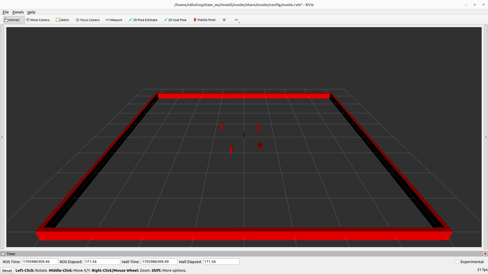

# Nusim  Description
The nusim package provides a simulated robot environment for visualization of turtlebot3 robots in Rviz2. It is capable of creating stationary walls and tracking the position of a robot. The arena walls and obstacles display as markers in Rviz2. It offers services like `teleport` which allows the user to move the robot to a desired pose and `reset` to reset the simulation to the initial conditions.

# Launchfile description
- `ros2 launch nusim nusim.launch.xml`:
  Arguments (pass arguments as '<name>:=<value>'):

    `'rviz_config':`
        Rviz2 configuration for the simulator (.rviz)
        (default: FindPackageShare(pkg='nusim') + '/config/nusim.rviz')

    `'use_rviz':`
        Controls whether rviz2 is launched. Valid choices are: ['true', 'false']
        (default: 'true')

    `'use_jsp':`
        Controls whether the joint_state_publisher is used to publish default joint states. Valid choices are: ['true', 'false']
        (default: 'true')

    `'color':`
        Determines color of turtlebot3 to be passed to xacro file. Valid choices are: ['red', 'green', 'blue', 'purple', '']
        (default: 'purple')

    `'config_file':`
        Initial configuration for the simulator (.yaml)
        (default: 'basic_world.yaml')

    * The launch file loads the turtlebot from the nuturtle_description package through its launch file:
      `nuturtle_description/launch/load_one.launch.py`.
    * It takes an argument `config_file` which stores the configuration for the simulator - defaults to  `basic_world_yaml` 
    * The main simulation node `nusim` is launched along with Rviz2 to visulaize the turtlebot3 in the simulator environment.
  
# Parameters
* rate (int): Timer frequency (Hz)
* x0 (double): Initial x coordinate of the robot (m)
* y0 (double): Initial y coordinate of the robot (m)
* theta0 (double): Initial theta angle of the robot (radians)
* walls.arena_x_length (double): Length of arena in world x direction (m)
* walls.arena_y_length (double): Length of arena in world y direction (m)
* obstacles.x (std::vector<double>): List of the obstacles' x coordinates (m)
* obstacles.y (std::vector<double>): List of the obstacles' y coordinates (m)
* obstacles.r (double): Radius of cylindrical obstacles (m)
* motor_cmd_per_rad_sec (double): Each motor command unit (mcu) is 0.024 (rad/sec)
* encoder_ticks_per_rad (double): The number of encoder ticks per radian (ticks/rad)
  
Image of simulator in Rviz2

