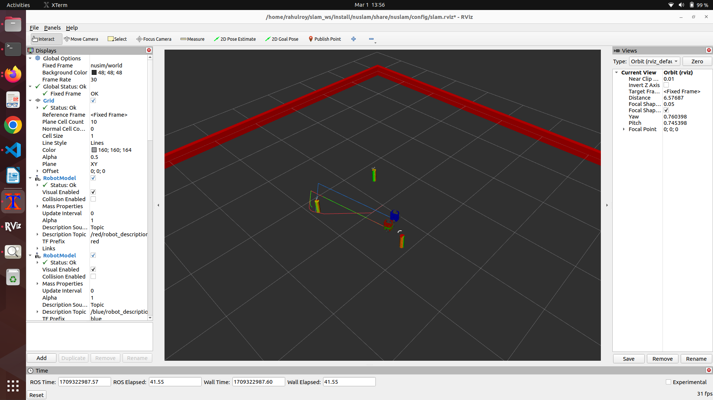

## NUSLAM
This packge implements a Feature-Based Kalman Filter SLAM

Red turtle : simulated ground truth of robot
Green turtle : pose estimate using EKF SLAM
Blue turtle : pose estimate using odometry

## Launch Files
ros2 launch nuslam slam.launch.xml cmd_src:=teleop robot:=nusim --show-args
Arguments (pass arguments as '<name>:=<value>'):

    'cmd_src':
        Source of cmd_vel commands, decides which node publishes command vel to the turtlebot - circle, teleop, none
        (default: 'teleop')

    'robot':
        Launch in simulation or real robot - nusim, localhost, none
        (default: 'nusim')

    'use_rviz':
        Controls whether rviz2 is launched. Valid choices are: ['true', 'false']
        (default: 'true')

    'use_jsp':
        joint_state_publisher is launched or not. Valid choices are: ['true', 'false']
        (default: 'true')

    'color':
        Determines color of turtlebot3 to be passed to xacro. Valid choices are: ['red', 'green', 'blue', 'purple', '']
        (default: 'purple')

    'body_id':
        body frame of the robot
        (default: 'blue/base_footprint')

    'odom_id':
        odometry frame
        (default: 'odom')

    'wheel_left':
        left wheel joint
        (default: 'wheel_left_joint')

    'wheel_right':
        The name of the right wheel joint
        (default: 'wheel_right_joint')

    'config_file':
        Initial configuration for the simulator (.yaml)
        (default: 'basic_world.yaml')

## Example Usage

Here is an image of the robot using the nuslam package to perform SLAM.

 Here is the robot using the nuslam package to perform SLAM. 

 [Screencast from 03-01-2024 01:32:32 PM.webm](https://github.com/ME495-Navigation/slam-project-roy2909/assets/144197977/591c6368-7890-4466-b56e-6498aa5c9ff8)