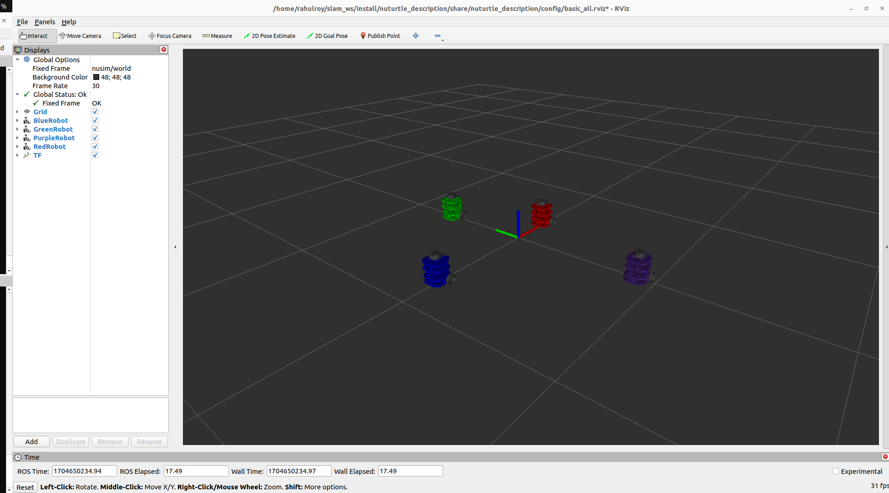

# Nuturtle  Description
URDF files for Nuturtle Turtlebot3
* `ros2 launch nuturtle_description load_one.launch.py` to see the purple robot in rviz.
* `ros2 launch nuturtle_description load_all.launch.xml` to see four copies of the robot in rviz.

* The rqt_graph when all four robots are visualized (Nodes Only, Hide Debug) is:

# Launch File Details
* `ros2 launch nuturtle_description load_one.launch.py --show-args`
   Arguments (pass arguments as '<name>:=<value>'):
    `'use_rviz':`
        Controls whether rviz2 is launched. Valid choices are: ['true', 'false']
        (default: 'true')

    `'use_jsp':`
        joint_state_publisher is launched or not. Valid choices are: ['true', 'false']
        (default: 'true')

    `'color':`
        Determines color of turtlebot3 to be passed to xacro. Valid choices are: ['red', 'green', 'blue', 'purple', '']
        (default: 'purple')

* `ros2 launch nuturtle_description load_all.launch.xml --show-args`
    Arguments (pass arguments as '<name>:=<value>'):

    `'use_rviz':`
        Controls whether rviz2 is launched. Valid choices are: ['true', 'false']
        (default: 'true')

    `'use_jsp':`
        Controls whether the joint_state_publisher is used to publish default joint states. Valid choices are: ['true', 'false']
        (default: 'true')

    `'color':`
        Determines color of turtlebot3 to be passed to xacro file. Valid choices are: ['red', 'green', 'blue', 'purple', '']
        (default: 'purple')

